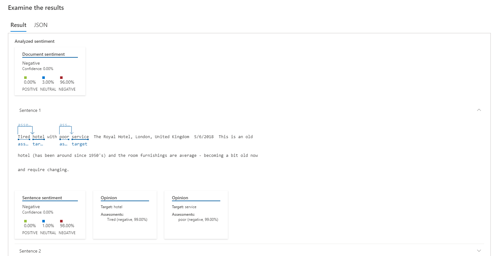
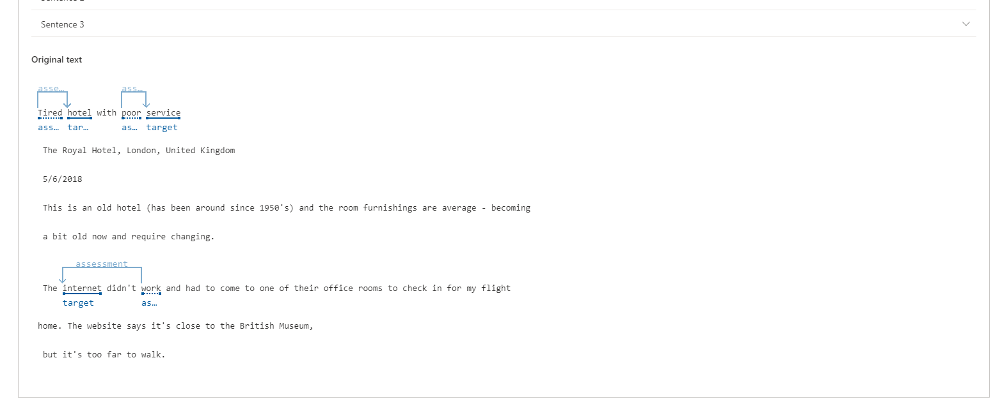
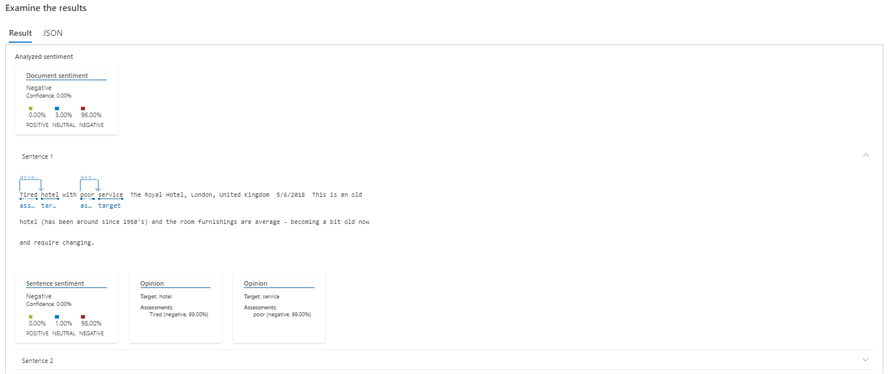
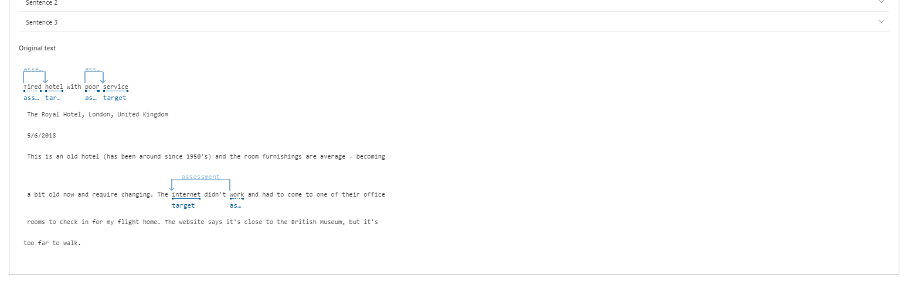

# languageai900
 Language idioma AI 900
Analise texto com Language Studio
Neste exercício, você explorará os recursos da linguagem Azure AI analisando alguns exemplos de avaliações de hotéis. Você usará o Language Studio para entender se as avaliações são em sua maioria positivas ou negativas.

O Processamento de Linguagem Natural (PNL) é um ramo da IA ​​que lida com a linguagem escrita e falada. Você pode usar a PNL para construir soluções que extraiam significado semântico de texto ou fala, ou que formulem respostas significativas em linguagem natural.

Por exemplo, suponha que a agência de viagens fictícia Margie's Travel incentive os clientes a enviar avaliações sobre estadias em hotéis. Você pode usar o serviço de idiomas para identificar frases-chave, determinar quais avaliações são positivas e quais são negativas ou analisar o texto da avaliação em busca de menções a entidades conhecidas, como locais ou pessoas.

O Azure AI Language Service inclui análise de texto e recursos de PNL. Isso inclui a identificação de frases-chave no texto e a classificação do texto com base no sentimento.

Crie um recurso de idioma
Você pode usar muitos recursos do Azure AI Language com um recurso de idioma ou de serviços do Azure AI . Existem alguns casos em que apenas um recurso Idioma pode ser usado. Para o exercício abaixo, utilizaremos um recurso Linguagem . Se ainda não o fez, crie um recurso de idioma na sua assinatura do Azure.

Em outra guia do navegador, abra o portal do Azure em https://portal.azure.com , entrando com a conta da Microsoft associada à sua assinatura do Azure.

Clique no botão ＋Criar um recurso e pesquise Serviço de idioma . Selecione criar um plano de serviço de idiomas . Você será levado a uma página para selecionar recursos adicionais . Mantenha a seleção padrão e clique em Continuar para criar seu recurso .

Na página Criar Idioma , configure-o com as seguintes configurações:
Assinatura : sua assinatura do Azure .
Grupo de recursos : selecione ou crie um grupo de recursos com um nome exclusivo .
Região : Leste dos EUA.
Nome : Insira um nome exclusivo .
Nível de preços : F0 grátis ou S se F0 grátis não estiver disponível
Ao marcar esta caixa, confirmo que li e compreendi todos os termos abaixo : Selecionado .
Selecione Revisar + criar e depois Criar e aguarde a conclusão da implantação.
Configure seu recurso no Azure AI Language Studio
Em outra guia do navegador, abra o Language Studio em https://language.cognitive.azure.com e entre.

Quando solicitado com Select an Azure resource , faça as seguintes configurações:

Diretório do Azure : diretório padrão, o diretório que você está usando
Assinatura do Azure : selecione a assinatura que você está usando
Tipo de recurso : Idioma
Nome do recurso : selecione o recurso de serviço de idioma que você acabou de criar
Em seguida, selecione Concluído .

Importante : a partir de julho de 2023, os serviços de IA do Azure abrangem tudo o que era anteriormente conhecido como Serviços Cognitivos e Serviços de IA Aplicados do Azure. Algumas interfaces de usuário ainda estão atualizando suas referências de Cognitive Servicespara Azure AI services. Os dois nomes referem-se ao mesmo tipo de recurso.

Observação : se você não for solicitado a escolher um recurso de idioma, pode ser porque você possui vários recursos de idioma em sua assinatura; nesse caso:

Na barra na parte superior da página, selecione Configurações (⚙) .
Na página Configurações , visualize a guia Recursos .
Selecione o recurso que você acabou de criar e selecione Alternar recurso . Certifique-se de que a identidade gerenciada esteja habilitada . Ative o recurso de idioma.
No topo da página, selecione Language Studio para retornar à página inicial do Language Studio.
Analise avaliações no Language Studio
Num navegador web, navegue até Language Studio em https://language.cognitive.azure.com .

Na página inicial Bem-vindo ao Language Studio , selecione a guia Classificar texto e, em seguida, selecione o bloco Analisar sentimento e extrair opiniões .

Em Selecionar idioma do texto , selecione Inglês .

Em Selecione seu recurso do Azure , selecione seu recurso.

Em Digite seu próprio texto, carregue um arquivo ou use um de nossos textos de exemplo , copie e cole a seguinte revisão:

Código
 Tired hotel with poor service
 The Royal Hotel, London, United Kingdom
 5/6/2018
 This is an old hotel (has been around since 1950's) and the room furnishings are average - becoming a bit old now and require changing. The internet didn't work and had to come to one of their office rooms to check in for my flight home. The website says it's close to the British Museum, but it's too far to walk.
Marque a caixa para confirmar que a demonstração incorrerá em uso e poderá incorrer em custos e selecione Executar .

Revise a saída. Observe que o documento é analisado quanto ao sentimento, assim como cada frase . Selecione Frase 1 para mostrar a análise de sentimento dessa frase.

Observe que há um sentimento geral seguido por pontuações próximas a três categorias: pontuação positiva , pontuação neutra e pontuação negativa . Em cada uma das categorias é atribuída uma pontuação entre 0 e 1. Essas pontuações de confiança indicam a probabilidade do texto fornecido ser um sentimento específico.

Selecione a frase 1 novamente para fechar.

Role para cima para selecionar Limpar caixa de texto e copie e cole a seguinte revisão:

Código
 Good Hotel and staff
 The Royal Hotel, London, UK
 3/2/2018
 Clean rooms, good service, great location near Buckingham Palace and Westminster Abbey, and so on. We thoroughly enjoyed our stay. The courtyard is very peaceful and we went to a restaurant which is part of the same group and is Indian ( West coast so plenty of fish) with a Michelin Star. We had the taster menu which was fabulous. The rooms were very well appointed with a kitchen, lounge, bedroom and enormous bathroom. Thoroughly recommended.
Selecione Executar . Revise o resultado e o sentimento e o nível de confiança.

Selecione Limpar caixa de texto novamente e copie e cole a seguinte revisão:

Selecione Executar e analise o sentimento juntamente com o nível de confiança. Dê uma olhada no texto e compare-o com a análise de sentimento que o serviço retornou.

Neste exercício você usou o Language Studio para criar um novo recurso de idioma ou usar um recurso de idioma existente. Você habilitou o recurso em Configurações antes de experimentar o serviço de mineração de sentimento e opinião. Em seguida, você testou o serviço com três trechos de texto.